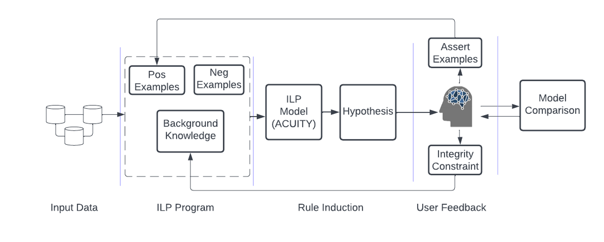
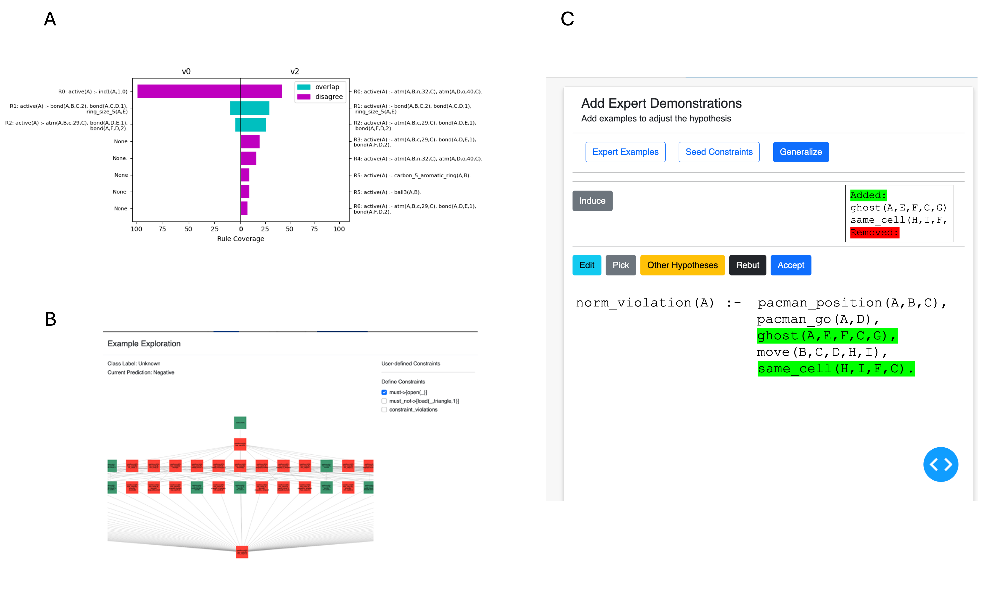

# RAIMEE: Relational AI Model Explorer and Editor

**RAIMEE** is an **interactive visual interface** for exploring, editing, and refining hypotheses induced via **Inductive Logic Programming (ILP)**.  
It provides a **no-code environment** for domain experts to interact with relational machine learning models — combining visual analytics with logical reasoning.

> *RAIMEE extends ideas from AIMEE (“AI Model Explorer and Editor”) into the relational domain, integrating logic-based reasoning from ACUITY with intuitive, human-centered visual interaction.*

---

## Overview

RAIMEE enables users to iteratively train and refine **logic-based machine learning models** through an intuitive visual dashboard.  
Users can induce rule-based hypotheses, inspect them through multiple relational visualizations, and refine them by providing **interactive feedback** via visual mechanisms — no Prolog expertise required.

This repository accompanies the publication:

> **Deane, O., & Ray, O. (2023)**. *Interactive Model Refinement in Relational Domains with Inductive Logic Programming*.  
> In *Proceedings of the 28th International Conference on Intelligent User Interfaces (IUI '23 Companion)*. ACM.  
> [DOI: 10.1145/3581754.3584150](https://doi.org/10.1145/3581754.3584150)

---

## System Architecture

RAIMEE integrates three key layers:

1. **Frontend (Dash + Python):**
   - Built with [Plotly Dash](https://dash.plotly.com/)
   - Interactive visualizations, user feedback mechanisms, and layout components
   - Subdirectories:
     - `assets/` – static files (CSS, JS, icons)
     - `components/` – Dash components for visualization and feedback
     - `layouts/` – pre-defined Dash layouts and static interface artefacts

2. **Backend (Prolog + Python):**
   - Logical reasoning and hypothesis induction via ILP
   - Prolog modules for background knowledge, rule induction, and constraint handling

3. **Data Layer:**
   - `data/` directory contains example relational datasets, including:
     - **Mutagenesis dataset**
     - **Michalski’s Train Problem**
   - Users can also import their own relational data (SQL or linked CSVs)

---

## Repository Structure

- `requirements.txt` — Python dependencies.
- `README.md` — Project documentation.
- `src/`
  - `app.py` — Main entry point (Dash server).
  - `assets/` — Static assets (CSS, JS, images).
  - `components/` — Dash components (visualizations, interactive mechanisms).
  - `data/` — Example relational datasets:
    - `mutagenesis/` — Mutagenicity benchmark data.
    - `trains/` — Michalski’s Train Problem data.
  - `layouts/` — Dash layouts and static UI artefacts.
  - _Additional Python/Prolog modules for ILP and reasoning._

## Running the Application

~~~bash
python src/app.py
~~~

Once launched, open your browser at:
```http://127.0.0.1:8050/```


> You can modify host/port in `src/app.py` if needed. Requires everything in `requirements.txt`, **Python ≥ 3.9** and a Prolog environment such as SWI-Prolog.


## Interface Overview

RAIMEE provides a no-code, interactive workflow for inductive logic programming over **relational** datasets:

- **Dataset Overview** — Inspect relational data via schema diagrams, linked tables, and graph views.
- **Hypothesis Induction** — Induce an initial rule-set (hypothesis) from background knowledge and class labels.
- **Hypothesis Inspection** — View rules in logical or natural language; assess rule coverage/support visually.
- **Model Editing** — Provide feedback with integrity constraints, define/edit rules, and assert new (counter)examples.
- **Model Comparison** — Compare versions of induced rule-sets to see how feedback shaped hypotheses.

## System Workflow (Diagram)




## Expected Output

When the app is running, you should see a multi-tab application. The below visualises some of the featured interactive mechanisms:




## Example Datasets

| Dataset               | Description                                      | Location                |
|-----------------------|--------------------------------------------------|-------------------------|
| Mutagenesis           | Classical ILP benchmark for mutagenicity         | `src/data/mutagenesis/` |
| Michalski’s Trains    | Illustrative relational reasoning task           | `src/data/trains/`      |


## Technical Notes

- Front-end: **Dash + Python** (visualizations, components, layouts).
- Back-end: **Prolog** for ILP-style logical reasoning; Python wrappers to orchestrate induction and constraints.
- Data ingestion: relational inputs (SQL or linked CSVs with PK/FK); translated to logical facts in a background knowledge base.
- Interactive mechanisms:
  - **Integrity constraints** to include/exclude literals in future hypotheses.
  - **Rule editing/definition** via UI, translated to logic constraints.
  - **Assert examples** (positive/negative) to rebut/shape hypotheses.
- Visualization: Plotly for charts; graph views for relational structure and rule coverage.
- Run locally with `python src/app.py` (default: `http://127.0.0.1:8050/`).


## Authors

- **Oliver Deane** — University of Bristol — <oliver.deane@bristol.ac.uk>  
- **Oliver Ray** — University of Bristol


## Citation

If you use this software in your research, please cite:

~~~bibtex
@inproceedings{deane2023interactive,
  title        = {Interactive Model Refinement in Relational Domains with Inductive Logic Programming},
  author       = {Deane, Oliver and Ray, Oliver},
  booktitle    = {Proceedings of the 28th International Conference on Intelligent User Interfaces (IUI '23 Companion)},
  year         = {2023},
  organization = {ACM},
  doi          = {10.1145/3581754.3584150}
}
~~~


## License

This project is released under the **MIT License**. See `LICENSE` for details.


## Acknowledgments

Supported by the **UKRI CDT in Interactive Artificial Intelligence** (EP/S022937/1).  
Thanks to **Elizabeth Daly**, **Inge Vejsbjerg**, and **Steve Moyle** for their insights on ILP and interpretability.
